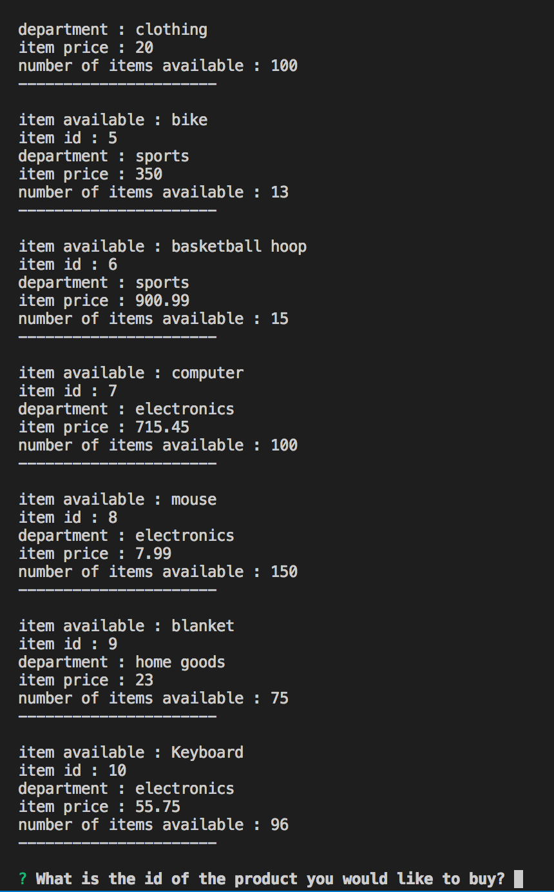

# bamazon

This app was created using mySQL, javascript, and node.js...Install the package file and copy the SQL files to get started. 

In this application, you can browse my digital marketplace for different items.  In the customer app, browse and purchase items on the command line.  All changes will be updated in the database.

[Watch the video to see how the app works](https://www.youtube.com/watch?v=sxWO0kOMVxg&feature=youtu.be)

From the customer view, scroll through the items available and choose an item to purhcase.  Once you purchase, the database automatically records the sale

The manager application allows for more functionality.  View product inventory if it is low, add to inventories, and add new products

The supervisor application allows the user to view the total sales of each department and create new departments

